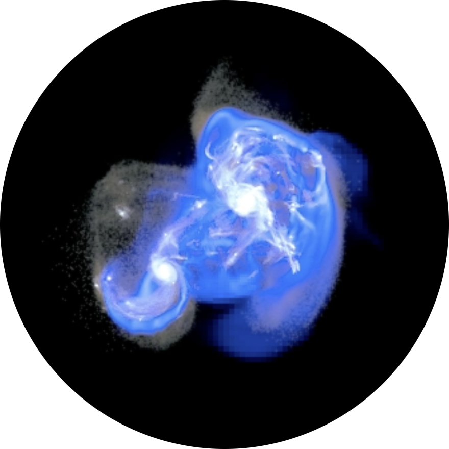

# Research

    
Research

    

        

            <a class="researchbutton" href="shell_galaxies.html">
             
            <b>Shell Galaxies</b> Petersson et al. (2023)
            </a>
        

        

            <a class="researchbutton" href="projects.html">
             
            <b>BSc & MSc Projects</b> McMillan, Petersson et al. (2022)
            </a>
        

        

            <a class="researchbutton" href="movies.html">
            

                 
                <!--
                 
                -->
            

            <b>Movies</b>
            </a>
        

    

