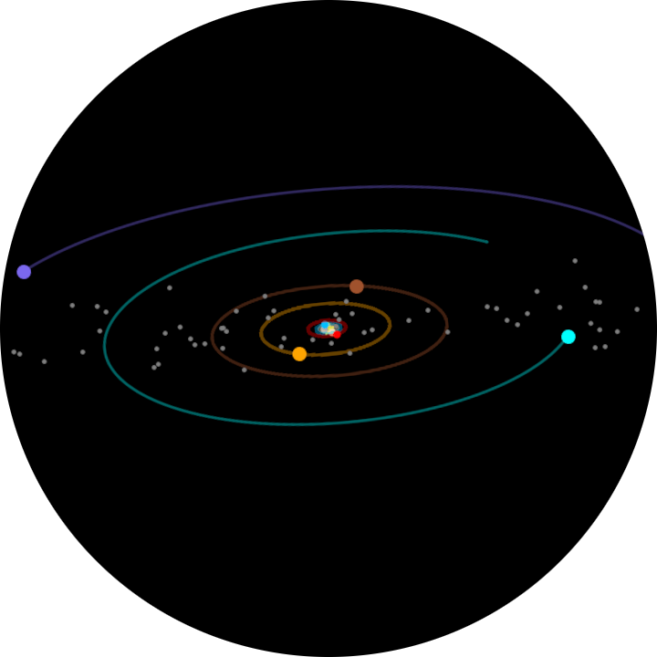

# Scientific Research

    

        <a class="inactivebutton" href="shell_galaxies.html">
         
        <b>Colliding Galaxies in a (Nut)Shell</b> Petersson et al. (2023)
        </a>
    

    

        <a class="inactivebutton" href="milky_way.html">
         
        <b>The Disturbed Outer Milky Way Disc</b> McMillan, Petersson et al. (2022)
        </a>
    

    

        <a class="inactivebutton" href="capture_iso.html">
         
        <b>Capture of ISOs in the Solar System</b>
        </a>
    

